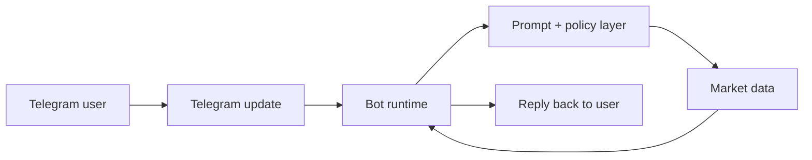

<pre>+-----------------------------+
|  user -> telegram -> bot    |
|                    |        |
|                 prompts     |
|                    |        |
|                 market api  |
|                    |        |
|                 response    |
+-----------------------------+</pre>

## Flow

## Implementation Notes
- keep the transport layer thin
- isolate prompt policy from integration code
- add validation around external data before answering
