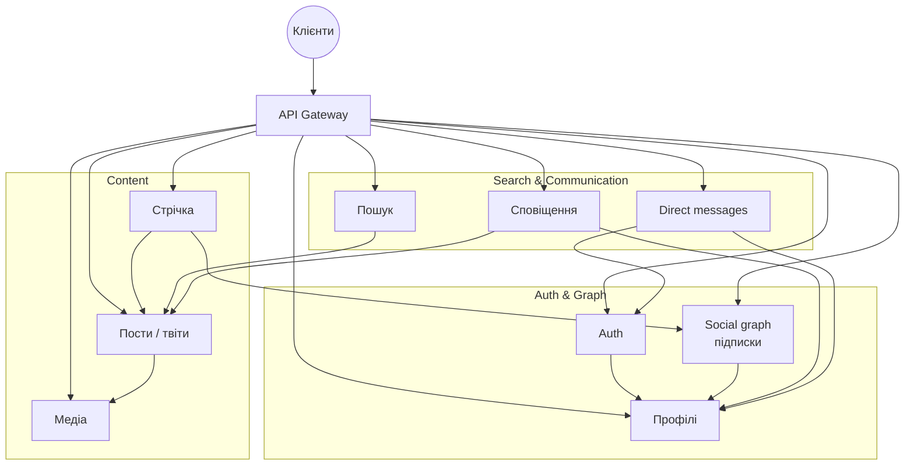
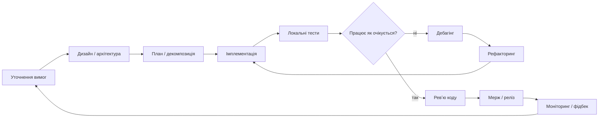
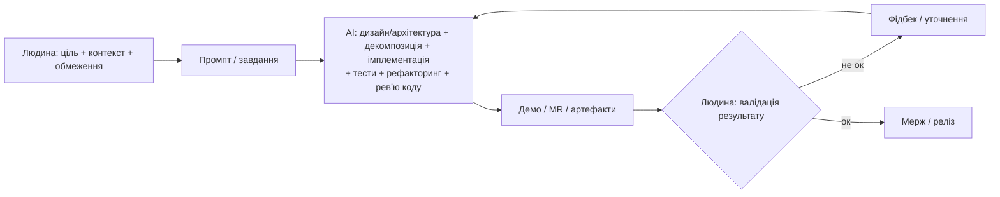

### Рутина інженера

##### 5 років тому



##### Цикл роботи розробника




##### Сьогодні

```md
Створи повний клон системи "X": API Gateway, Auth → Profile, Social graph → Profile, пости з медіа, стрічка що збирає граф + пости, пошук по постах, сповіщення про пости і профілі, DM з перевіркою auth. Имплементуй проект, зроби його готовим до високого навантаження. Не роби помилок!
```



<br />
<br />

### Рутина НЕ інженера

#### 5 років тому


#### Сьогодні

```md
Зроби HFT бота для поліка з прибутковою стратегією та без loss.
```
