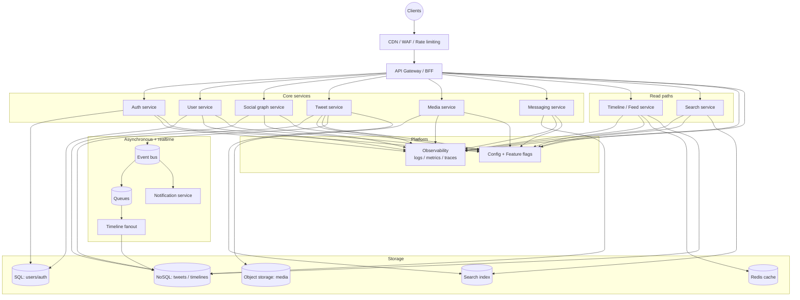
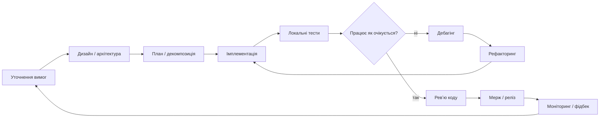
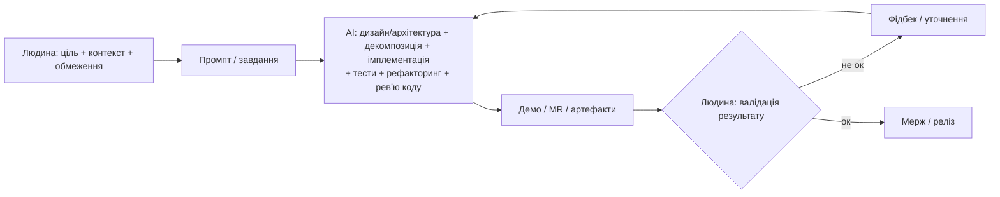
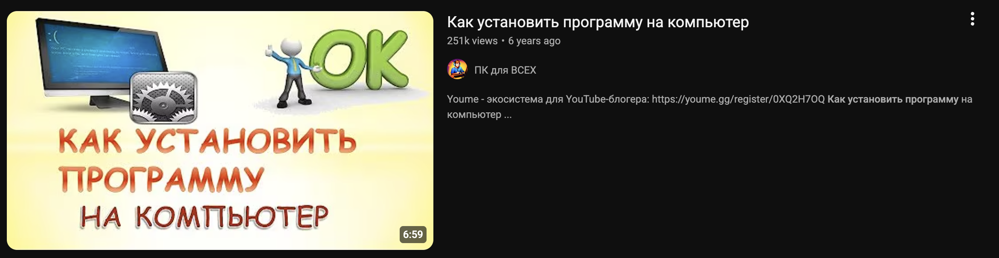

## Рутина інженера

### 5 років тому



### Сьогодні

```md
Імплементуй систему (компоненти, звʼязки, read/write paths, async-процеси, сховища).

## Ціль
Зібрати працюючий клон “X” у вигляді production-орієнтованого монорепо/полірепо (на твій вибір), який піднімається локально і містить мінімально повний вертикальний зріз функціоналу.

## Edge + Gateway
- `CDN / WAF / Rate limiting` (можна як заглушка/конфіг у локальному середовищі)
- `API Gateway / BFF`: єдина точка входу для клієнтів, маршрутизація до сервісів, auth middleware, кореляційні ID

## Core services
- `Auth service` → SQL (реєстрація/логін, JWT/сесії, refresh, RBAC за потреби)
- `User service` → SQL (профіль, налаштування)
- `Social graph service` → NoSQL/KV (follow/unfollow, список фоловінг/фоловерів)
- `Tweet service` → NoSQL/KV (пости, лайки/реплаї мінімально), **пише події в Event bus**
- `Media service` → Object storage (upload/download, привʼязка медіа до поста)
- `Messaging service (DM)` → NoSQL/KV (діалоги/повідомлення), **перевірка auth**

## Asynchronous + realtime
- `Event bus` + `Queues`
- `Timeline fanout`: споживає події постів → розкладає у timelines в NoSQL/KV
- `Notification service`: споживає події → нотифікації про пости/профілі

## Read paths
- `Timeline / Feed service`: читає timelines з NoSQL/KV + кешує в Redis (hot paths)
- `Search service`: пошук по постах через `Search index`
- `Tweet service` оновлює `Search index` (індексація постів)

## Platform
- `Config + Feature flags` (мінімальна реалізація: централізований конфіг/ENV + прапорці)
- `Observability`: structured logs, metrics, traces (мінімум: кореляція запитів між сервісами)

## Вимоги до результату
- Постав всі сервіси + залежності в `docker compose` (SQL, Redis, KV/NoSQL, object storage-емуль, search engine-емуль/мінімальна реалізація).
- Опиши API контракти (OpenAPI або чіткі REST endpoints), моделі даних, і **подієві контракти** (назви подій, payload).
- Додай базові тести (unit + 1-2 інтеграційні на write→event→fanout→feed).
- Додай короткий `README` з командами запуску/перевірки.

Почни з уточнення припущень, потім дай план, і після цього — реалізуй код.
```

<br />
<br />

## Цикл роботи розробника

### Сьогодні



### 5 років тому



<br />
<br />


## Рутина НЕ інженера

### 5 років тому



### Сьогодні

```md
Зроби HFT бота для поліка з прибутковою стратегією та без loss.
```
