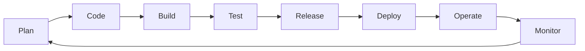
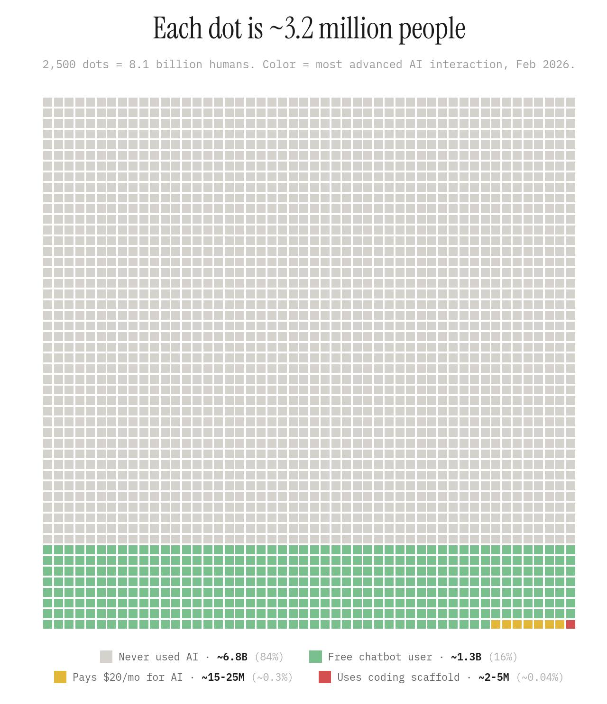

## Сьогодні кодити можуть всі, але

1. Що робити з кодом?
2. Як запускати?
3. Де запускати?
4. Як скейлити?
5. Як дебажити?

Тут ми і стикаємось з реальністю

 

### SDLC (DevOps)

## Сучасний тулінг для розробки

1. Anthropic -> Claude -> Claude Code ($20 base subscription)
2. OpenAI -> ChatGPT -> Codex ($20 base subscription)
3. Anysphere -> Cursor ($20 base subscription)
4. Alphabet -> Gemini -> Antigravity ($20 base subscription)

**!enterprice solution ви не напишете, але, тепер, спокійно можна робити тулінг для себе без tech скілів**

**!якщо ти вмієш вирішувати/автоматизовувати свої процеси швидко та ефективно - ти попереду багатьох**

