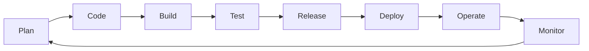

## Сьогодні всі можуть кодити

Але:
1. Що робити з кодом?
2. Як валідувати?
3. Як запускати?
4. Де запускати?
5. Як скейлити?
6. Як дебажити?

Тут ми і стикаємось з реальністю. **Coding is solved, other 8 circles og hell - not (yet)**.

 
 

## SDLC (DevOps)

Це базовий циклічний сценарій розвитку продуктів інформаційної технології.

За кадром залишається продуктова діяльність:

> \>_ Аналітика

> \>_ Ідеї

> \>_ Скейл

> \>_ Розробка стратегій

> \>_ і тд.
