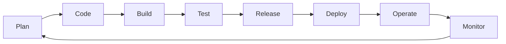

#### Сьогодні кодити можуть всі, але

1. Що робити з кодом?
2. Як запускати?
3. Де запускати?
4. Як скейлити?
5. Як дебажити?

Тут ми і стикаємось з реальністю

 

#### SDLC (DevOps)

```mermaid
flowchart LR
    P[Plan] --> Co[Code] --> Bu[Build] --> Te[Test]
    Te --> R[Release]
    R --> De[Deploy] --> Op[Operate] --> M[Monitor]
    M --> P
```
