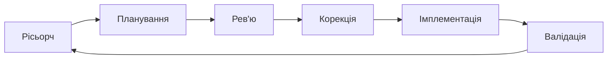

## Типовий підхід роботи з AI

\>_ Є бажання вирішити проблему "X".

\>_ Немає фундаментального розуміння проблеми.

\>_ Немає плану рішення (логічного).

\>_ Дія: one shot prompt -> \`зроби мені бота\`.

\>_ Результат: вигорання без прогресу, AI == шляпа, ти позаду.

 
 

## Правильний підхід роботи з AI

#### Golden Loop

\>_ **Рісьорч** — збираємо інформацію: що вже існує, як інші вирішували схожу задачу, які є обмеження.

\>_ **Планування** — формуємо з AI покроковий план дій; планування — найважливіший крок.

\>_ **Рев'ю** — перечитуємо план самі або просимо іншу AI-сесію знайти слабкі місця.

\>_ **Корекція** — виправляємо помилки та уточнюємо план на основі знайдених зауважень.

\>_ **Імплементація** — даємо AI чітке завдання з контекстом і отримуємо робочий результат. Теж в свіжій сесії.

\>_ **Валідація** — перевіряємо, що результат дійсно працює і відповідає початковій задачі.
