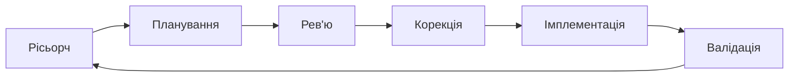

## Типовий підхід роботи з AI

\>_ Є бажання вирішити проблему "X".

\>_ Немає фундаментального розуміння проблеми.

\>_ Немає плану рішення (логічного).

\>_ Дія: one shot prompt -> \`зроби мені бота\`.

\>_ Результат: ідейне вигорання, AI == шляпа, ти позаду.

 
 

## Правильний підхід роботи з AI

\>_ **Рісьорч** — збираємо інформацію: що вже існує, як інші вирішували схожу задачу, які є обмеження.

\>_ **Планування** — формуємо з AI покроковий план дій; планування - найважливіший степ.

\>_ **Рев'ю** — перечитуємо план самі або просимо іншу AI-сесію знайти слабкі місця.

\>_ **Корекція** — виправляємо помилки та уточнюємо план на основі знайдених зауважень.

\>_ **Імплементація** — даємо AI чітке завдання з контекстом і отримуємо робочий результат. Теж в свіжій сесії.

\>_ **Валідація** — перевіряємо, що результат дійсно працює і відповідає початковій задачі.

 

## Приклад: бот для нотифікацій про погодні евенти на Polymarket

| Крок | Що робимо | Приклад промпту / дії |
|---|---|---|
| **Рісьорч** | Дізнаємось, чи має Polymarket публічний API, як отримати список евентів, які є бібліотеки для Telegram ботів | *"Які публічні API є у Polymarket? Як отримати список активних евентів? Покажи документацію та приклади відповідей"* |
| **Планування** | Просимо AI скласти покроковий план: які компоненти потрібні, як вони зʼєднані, який потік даних | *"Склади план для Telegram-бота, який кожні 10 хв перевіряє нові Polymarket евенти з тегом weather і надсилає повідомлення у чат. Опиши архітектуру, залежності, кроки реалізації"* |
| **Рев'ю** | Відкриваємо нову сесію і просимо перевірити план на слабкі місця | *"Ось план бота (вставляємо). Знайди проблеми: що зламається при великому навантаженні? Що буде, якщо API Polymarket не відповідає? Чи нічого не пропущено?"* |
| **Корекція** | Повертаємось до плану і вносимо зміни за знайденими зауваженнями | *"Додай в план обробку помилок API, retry-логіку, та дедуплікацію — щоб бот не надсилав одне й те саме двічі"* |
| **Імплементація** | Даємо AI фінальний план + контекст і просимо написати код | *"Ось фінальний план (вставляємо). Напиши реалізацію на Python з використанням python-telegram-bot та requests. Один файл, з коментарями"* |
| **Валідація** | Запускаємо бота, перевіряємо вручну, просимо AI знайти баги в коді | *Запускаємо → перевіряємо, чи приходять повідомлення → просимо AI: "Проаналізуй цей код на баги та edge cases"* |
