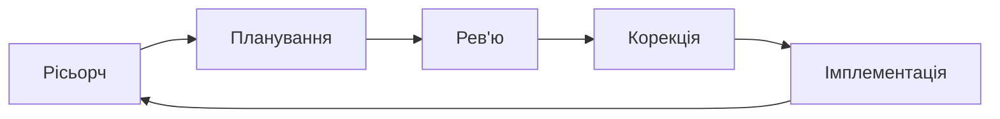

#### Типовий приклад

> \>// Є бажання вирішити проблему "X"

> \>// Немає фундаментального розуміння проблеми

> \>// Дія: one shot prompt -> ```зроби мені бота```

> \>// Результат: вигорання імпульсу, AI -> шляпа

<br />
<br />

#### Правильний цикл роботи з агентами


