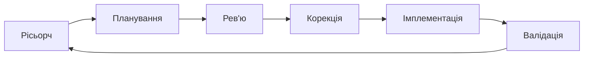

---

title: "Cooking"
summary: null
ascii_seed: circuit-pulse
ascii_height: 5

---

Є ідея
> Хочу отримувати сповіщення про нові івенти Polymarket пов`язані з землетрусами. В мене є думки про потенцийну статегію, потрібно мати модливісь дізнаватись про нові івенти з цієї категорії якогома швидше.

## Починаємо з нашого фреймворку

 
 
  

| Крок              | Що робимо                                                                                       | Приклад промпту / дії                                                                                                                                                               |
| ----------------- | ----------------------------------------------------------------------------------------------- | ----------------------------------------------------------------------------------------------------------------------------------------------------------------------------------- |
| **Рісьорч**       | Дізнаємось, деталі, що дадуть базіс для наступних степів.                                       | *"В мене"*                                                                                                                                                                          |
| **Планування**    | Просимо AI скласти покроковий план: які компоненти потрібні, як вони зʼєднані, який потік даних | *"Склади план для Telegram-бота, який кожні 10 хв перевіряє нові Polymarket евенти з тегом weather і надсилає повідомлення у чат. Опиши архітектуру, залежності, кроки реалізації"* |
| **Рев'ю**         | Відкриваємо нову сесію і просимо перевірити план на слабкі місця                                | *"Ось план бота (вставляємо). Знайди проблеми: що зламається при великому навантаженні? Що буде, якщо API Polymarket не відповідає? Чи нічого не пропущено?"*                       |
| **Корекція**      | Повертаємось до плану і вносимо зміни за знайденими зауваженнями                                | *"Додай в план обробку помилок API, retry-логіку, та дедуплікацію — щоб бот не надсилав одне й те саме двічі"*                                                                      |
| **Імплементація** | Даємо AI фінальний план + контекст і просимо написати код                                       | *"Ось фінальний план (вставляємо). Напиши реалізацію на Python з використанням python-telegram-bot та requests. Один файл, з коментарями"*                                          |
| **Валідація**     | Запускаємо бота, перевіряємо вручну, просимо AI знайти баги в коді                              | *Запускаємо → перевіряємо, чи приходять повідомлення → просимо AI: "Проаналізуй цей код на баги та edge cases"*                                                                     |

