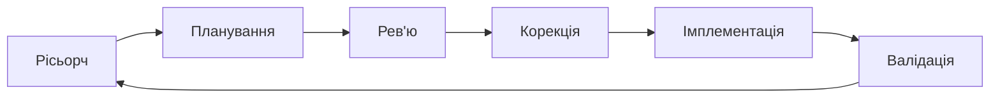
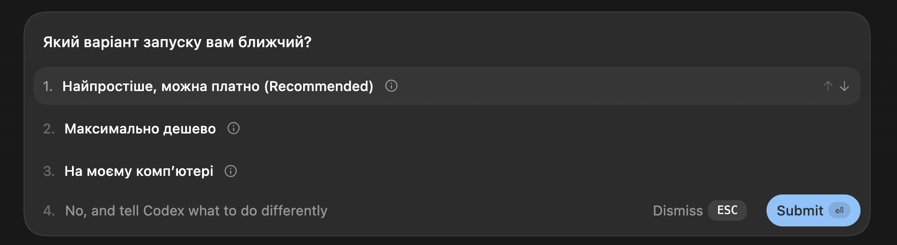

---

title: "Cooking"
summary: null
ascii_seed: circuit-pulse
ascii_height: 5

---

Є ідея

> Хочу отримувати сповіщення про нові івенти Polymarket пов`язані з землетрусами. В мене є думки про потенцийну статегію, потрібно мати модливісь дізнаватись про нові івенти з цієї категорії якогома швидше.

## Починаємо з нашого фреймворку



### Stage 1 - Рісьорч

Дізнаємось, деталі, що дадуть базіс для наступних степів.

```md
В мене є ідея. Допоможи зібрати контекст для реалізації ідеї. Мета цього запиту - я хочу отримати базову інформацію, що допоможе мені в подальшому плануванні реалізації моєї ідеї, зрозуміти як декомпозувати потенційне рішення, з яких шагів воно буде складатись, які додаткові дослідження варто провести перед плануванням та реалізацією.

Ідея: Хочу отримувати сповіщення про нові івенти Polymarket пов`язані з землетрусами. В мене є думки про потенційну стратегію, потрібно мати можливість дізнаватись про нові івенти з цієї категорії якнайшвидше.

Контекст: я не технічний спеціаліст, я не знаю як працює софт та програмування. Не розписуй все глибоко та детально, описуй тільки необхідну інформацію, що знадобиться мені для прийняття рішення.
```

### Stage 2 - Планування

```md
Сплануй реалізацію моєї ідеї.

Ідея: Хочу отримувати сповіщення про нові івенти Polymarket пов`язані з землетрусами. В мене є думки про потенційну стратегію, потрібно мати можливість дізнаватись про нові івенти з цієї категорії якнайшвидше.

Контекст:
- Я не технічна людина, я не розумію терминології програмної розробки
- Максимальна затримка між створенням и сповіщенням не повинна бути більше 2хв

Вимоги:
- Задай мені питання, що допоможуть тобі зібрати більше деталей про проблемі та допоможуть правильно реализувати инструмент
- Не задавай мені питання технічного характеру, я нічого не розумію в програмуванні
- Обери инструментарій для вирішення проблеми відштовхуючись від загальноприйнятих та зрозумілих стандартів. Інструментарій повинен чітко підходити під проблематику
- Перед вірішенням як реалізовувати бота проаналізуй API https://docs.polymarket.com/api-reference/introduction. Вияви потенційни механізми, що ми можемо використати для вирішення нашої проблеми
- Сплануй найпростіші варіанти розгортання цього інструменту. Де і як його можна запустити
- Опиши детальну документацію як користуватись інструментом та як його запускати. Інструкція має бути зрозуміла не технічній людині
```



### Stage 3 - Корекція

```md
(в тій же сесії за плануванням) Не впевнений щодо X, чи можливо зробити Y?
або
згадав, що ще потрібно Z, чи можна розширити функціонал без втрати якості?
```

### Stage 4 - Імплементація

```md
Реалізуй план (додай повний текст, або прікріпи файл з планом)
```


| Крок              | Що робимо                                                                                       | Приклад промпту / дії                                                                                                                                                               |
| ----------------- | ----------------------------------------------------------------------------------------------- | ----------------------------------------------------------------------------------------------------------------------------------------------------------------------------------- |
| **Рісьорч**       | Дізнаємось, деталі, що дадуть базіс для наступних степів.                                       | *"В мене"*                                                                                                                                                                          |
| **Планування**    | Просимо AI скласти покроковий план: які компоненти потрібні, як вони зʼєднані, який потік даних | *"Склади план для Telegram-бота, який кожні 10 хв перевіряє нові Polymarket евенти з тегом weather і надсилає повідомлення у чат. Опиши архітектуру, залежності, кроки реалізації"* |
| **Рев'ю**         | Відкриваємо нову сесію і просимо перевірити план на слабкі місця                                | *"Ось план бота (вставляємо). Знайди проблеми: що зламається при великому навантаженні? Що буде, якщо API Polymarket не відповідає? Чи нічого не пропущено?"*                       |
| **Корекція**      | Повертаємось до плану і вносимо зміни за знайденими зауваженнями                                | *"Додай в план обробку помилок API, retry-логіку, та дедуплікацію — щоб бот не надсилав одне й те саме двічі"*                                                                      |
| **Імплементація** | Даємо AI фінальний план + контекст і просимо написати код                                       | *"Ось фінальний план (вставляємо). Напиши реалізацію на Python з використанням python-telegram-bot та requests. Один файл, з коментарями"*                                          |
| **Валідація**     | Запускаємо бота, перевіряємо вручну, просимо AI знайти баги в коді                              | *Запускаємо → перевіряємо, чи приходять повідомлення → просимо AI: "Проаналізуй цей код на баги та edge cases"*                                                                     |


