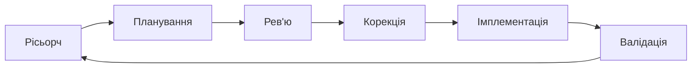

Є ідея

> Хочу отримувати сповіщення про нові івенти Polymarket, пов’язані з землетрусами. У мене є думки про потенційну стратегію; хочу мати можливість дізнаватися про нові івенти з цієї категорії якомога швидше.

## Починаємо з нашого фреймворку



### Stage 1 - Рісьорч

Дізнаємося про деталі, що дадуть базис для наступних кроків.

```md
У мене є ідея. Допоможи зібрати контекст для реалізації ідеї. Мета цього запиту — отримати базову інформацію, що допоможе мені в подальшому плануванні реалізації моєї ідеї, зрозуміти, як декомпозувати потенційне рішення, з яких кроків воно складатиметься, які додаткові дослідження варто провести перед плануванням та реалізацією.

Ідея: Хочу отримувати сповіщення про нові івенти Polymarket, пов’язані з землетрусами. У мене є думки про потенційну стратегію; потрібно мати можливість дізнаватися про нові івенти з цієї категорії якнайшвидше.

Контекст: я не технічний спеціаліст, я не знаю, як працює софт і програмування. Не розписуй усе глибоко й детально; описуй лише необхідну інформацію, яка знадобиться мені для прийняття рішення.
```

### Stage 2 - Планування

```md
Сплануй реалізацію моєї ідеї.

Ідея: Хочу отримувати сповіщення про нові івенти Polymarket, пов’язані з землетрусами. У мене є думки про потенційну стратегію; потрібно мати можливість дізнаватися про нові івенти з цієї категорії якнайшвидше.

Контекст:
- Я не технічна людина, я не розумію термінології програмної розробки
- Максимальна затримка між створенням і сповіщенням не повинна перевищувати 2 хв

Вимоги:
- Задай мені питання, що допоможуть тобі зібрати більше деталей про проблему та правильно реалізувати інструмент
- Не задавай мені питання технічного характеру, я нічого не розумію в програмуванні
- Обери інструментарій для вирішення проблеми відштовхуючись від загальноприйнятих та зрозумілих стандартів. Інструментарій повинен чітко підходити під проблематику
- Перед тим як вирішувати, як реалізувати бота, проаналізуй API https://docs.polymarket.com/api-reference/introduction. Вияви потенційні механізми, які ми можемо використати для вирішення нашої проблеми
- Сплануй найпростіші варіанти розгортання цього інструменту. Де і як його можна запустити
- Опиши детальну документацію, як користуватися інструментом і як його запускати. Інструкція має бути зрозумілою для нетехнічної людини
```


### Stage 3 — Рев’ю

читаємо, думаємо

### Stage 4 - Корекція

```md
(в тій же сесії за плануванням) Не впевнений щодо X, чи можливо зробити Y?
або
згадав, що ще потрібно Z, чи можна розширити функціонал без втрати якості?
```

### Stage 5 - Імплементація

```md
Реалізуй план (додай повний текст або прикріпи файл з планом).
```

### Stage 6 - Валідація

Валідуємо очима, перевіряємо, чи відповідає результат роботи вашим очікуванням.

> API-ключі не світити в чатах + перевірка «чи модель не вигадала endpoint».

<br />
<br />

### Stage 7 - Improvements (extra)

Починаємо коло заново, просимо провалідувати код, написаний AI, просимо підсвітити слабкі місця та зони покращення.

### Stage 8 - Rollout (extra)

Це вибір *де* він працює 24/7

**Локально**

- Свій ПК / ноутбук. Мінус — машина має бути ввімкнена 24/7 + залежність від домашнього інтернету; плюс — безкоштовно й просто.

**Cloud**

- [Railway](https://railway.app/) — простий деплой з Git, підходить для невеликих сервісів.
- [Render](https://render.com/) — схожий PaaS, фонові воркери / веб-сервіси.
- [Fly.io](https://fly.io/) — контейнери близько до регіону користувача, є безкоштовний шар з обмеженнями.
- [DigitalOcean Droplets](https://www.digitalocean.com/products/droplets) — віртуальний сервер «як свій Linux», повний контроль.
- [Hetzner Cloud](https://www.hetzner.com/cloud) — недорогі VPS, той самий сценарій.

```md
Опиши покроковий rollout: де краще хостити цей сервіс (локально vs один PaaS vs VPS), як зберігати API keys, як перезапускати після збою, що логувати. Орієнтуй на мінімальну складність і ~N USD/міс.
```

<br />
<br />

### Polished Planning Prompt (ідеальний приклад)

```md
Допоможи спланувати наступний інструмент.

Моя задача:
Я хочу [ОПИС ПРОБЛЕМИ].

Контекст:
- Я не технічна людина і не розумію складну термінологію розробки.
- Пояснюй усе простою людською мовою.
- Якщо без технічного терміна не обійтись, одразу коротко поясни його в 1 реченні.
- Мені важливий простий, надійний і недорогий варіант.
- Максимальна затримка між появою події та сповіщенням має бути не більше 2хв.

Що потрібно зробити:
1. Спочатку задай мені короткі уточнювальні питання, які допоможуть краще зрозуміти бізнес-задачу.
2. Не став мені технічних питань про код, сервери, бази даних, API-ключі, бібліотеки чи архітектуру.
3. Перед тим як пропонувати рішення, проаналізуй офіційну документацію API джерела даних:
   1. [ПОСИЛАННЯ 1 (як приклад https://docs.polymarket.com/api-reference/introduction)]
   2. ...
4. Визнач, які механізми API реально можна використати для вирішення задачі:
   - як знайти потрібні події;
   - як відфільтрувати їх за темою;
   - як перевіряти появу нових подій;
   - чи є обмеження по швидкості, пагінації, фільтрах або оновленню даних.
5. Після аналізу запропонуй найпростіше практичне рішення, а не “ідеальну складну систему”.
6. Обери легкий стек і просту архітектуру, орієнтуючись на зрозумілі та поширені підходи.

Бажаний технічний напрям:
- Без важкої інфраструктури.
- Без мікросервісів, Kubernetes, черг повідомлень і складних баз даних.
- В пріоритеті:
  - один невеликий сервіс або скрипт;
  - прямий запит до API джерела даних;
  - пряме надсилання сповіщень у Telegram;
  - просте збереження стану, наприклад JSON-файл або дуже легка база, тільки якщо це справді потрібно;
  - запуск за розкладом, якщо цього достатньо для потрібної швидкості сповіщень.
- Якщо для моєї задачі цього недостатньо, поясни чому простою мовою.

Що я хочу отримати у відповіді:
1. Список уточнювальних питань до мене.
2. Короткий висновок після аналізу API:
   - які можливості API корисні;
   - які є обмеження;
   - який підхід найкраще підходить.
3. Рекомендовану архітектуру простими словами:
   - з яких частин складається інструмент;
   - як вони взаємодіють між собою;
   - чому це найпростіший адекватний варіант.
4. Рекомендований стек:
   - мова або платформа;
   - спосіб запуску;
   - спосіб збереження стану;
   - канал сповіщень;
   - чому саме цей набір інструментів підходить.
5. Покроковий план реалізації без зайвої технічної глибини.
6. Найпростіші варіанти запуску:
   - на власному комп’ютері;
   - на недорогому сервері;
   - у хмарному сервісі, якщо це доречно.
   Для кожного варіанта вкажи:
   - складність;
   - надійність;
   - приблизну вартість;
   - для кого він підходить.
7. Дуже зрозумілу інструкцію для нетехнічної людини:
   - як цим користуватись;
   - як запустити;
   - як перевірити, що все працює;
   - що робити, якщо сповіщення перестали приходити.
8. Ризики, обмеження та припущення.
9. Якщо є кілька варіантів, спочатку покажи найпростіший рекомендований, а вже потім альтернативи.

Важливо:
- Відповідай простою мовою.
- Не перевантажуй мене технічними деталями.
- Якщо є вибір між “простішим” і “технічно красивішим”, пріоритет — простіший варіант.
- Не переходь до коду, поки спочатку не поставиш уточнювальні питання і не проаналізуєш API.
```